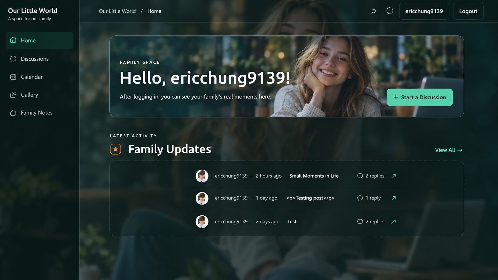

# Family Chat

[](./LICENSE)



> A private, shared family space for discussions, memories, albums, and trips.

[繁體中文 README](./README.zh-TW.md)

## Overview

Family Chat is a responsive React web app for a small, trusted family group. Members can publish rich-text posts, discuss them, upload album photos with metadata, plan itineraries, and manage their profile identity.

## Features

- **Family discussions** — rich-text posts, formatted previews, author profiles, avatars, titles/badges, post counts, and original-poster labels.
- **Comments and replies** — persistent Supabase-backed post conversations with author identity and rich content.
- **Shared albums** — create, browse, edit, and delete albums; upload photos; view photos in a lightbox; save location and text descriptions; delete photos.
- **Family trips** — create and browse itineraries with start and end dates.
- **Profiles** — edit display name, avatar, title/badge color and size.
- **Responsive UI** — dark glassmorphism styling, mobile navigation, desktop rail controls, and accessible buttons/labels.
- **Secure uploads** — images are stored under the authenticated family scope in Supabase Storage, with client-side type and size checks.

## Technical specifications

| Layer | Technology |
| --- | --- |
| Frontend | React 18, TypeScript, Vite |
| Styling | CSS, responsive layouts, glassmorphism theme |
| Rich text | `react-quill-new` / Quill |
| Icons | `lucide-react` |
| Backend | Supabase Auth, PostgreSQL, Row Level Security |
| Media | Supabase Storage (`family-photos`) with signed URLs |
| Hosting | Vercel SPA deployment |
| Quality | TypeScript build/typecheck and Node security tests |

## Local development

```bash
npm install
npm run dev
```

Create `.env.local` with `VITE_SUPABASE_URL` and `VITE_SUPABASE_ANON_KEY`, run [`supabase/schema.sql`](./supabase/schema.sql), then apply the migrations in `supabase/migrations/` in order.

```bash
npm run typecheck
npm run build
npm test
```

## Demo screenshots

- [English demo](./demo-en.png)
- [繁體中文 demo](./demo-zh-TW.png)

## Deployment

Connect the repository to Vercel, select `master` as the production branch, configure the Vite environment variables, and deploy. See [`DEPLOYMENT.md`](./DEPLOYMENT.md).

## License

This project is open source under the [MIT License](./LICENSE). You may use,
modify, and redistribute it subject to the license terms.
